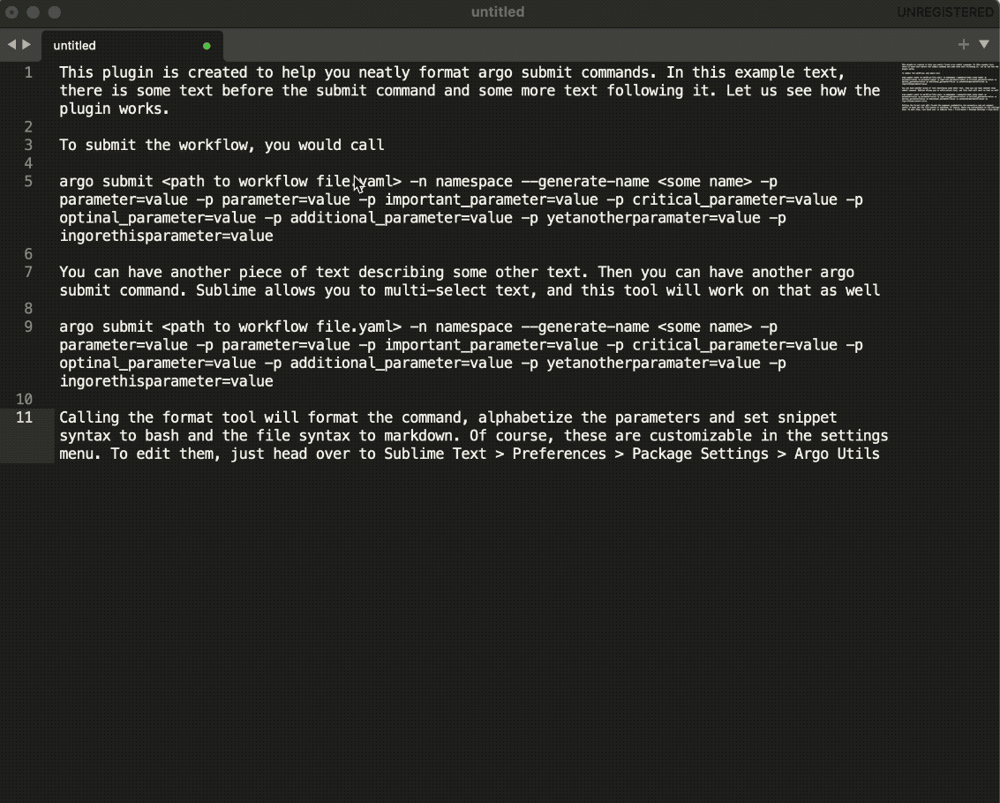

# Argo utils for Sublime Text
This plugin can help you sort and pretty format your `argo submit ...` commands. To use it simply select the text and call for **Format argo** from the heads-up display as shown below:

## Settings
The tool can be configured. To edit the settings, go to **"Sublime Text > Preferences > Package Settings > Argo Utils"**